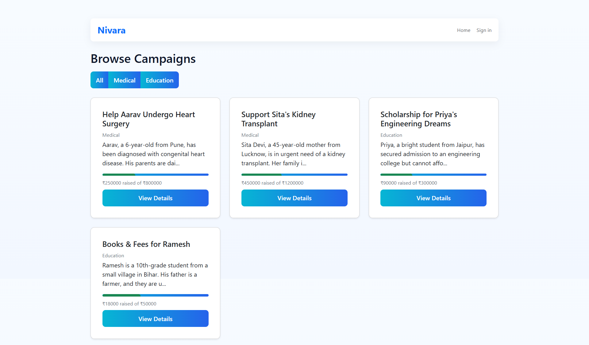
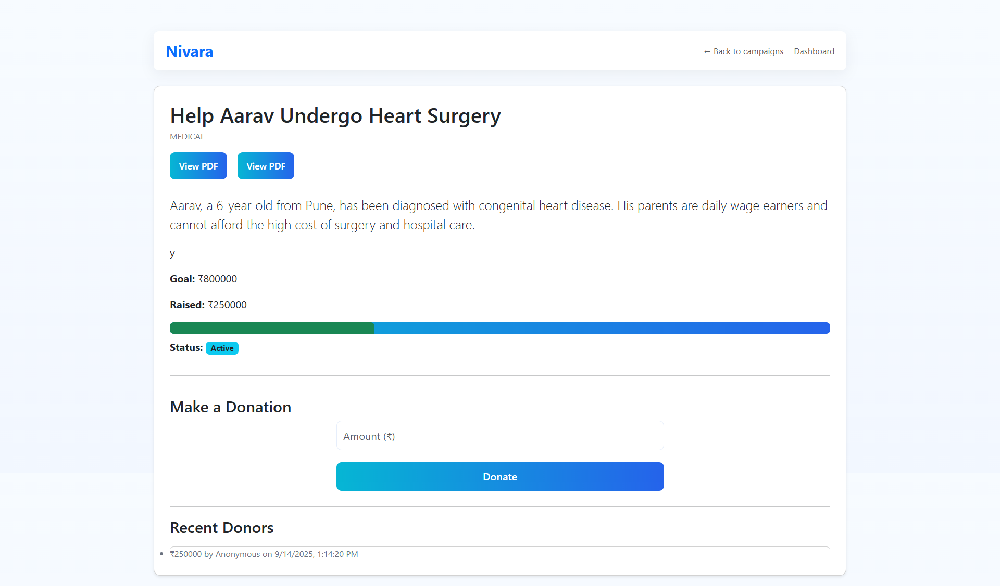
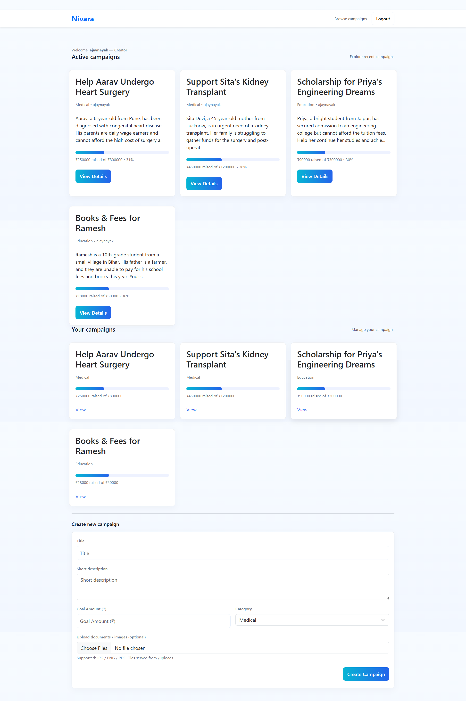

# Nivara — Crowdfunding for Medical & Education

Nivara is a full-stack web application built using the **MERN Stack** to provide a platform for people to raise and support funds for **medical emergencies** and **education needs**.

---

## 🚀 Features

- User Authentication (Creator, Donor roles)
- Create & Manage Campaigns
- Upload Supporting Documents (PDFs, Images)
- Secure Donation System
- Real-time Campaign Progress Tracking
- Separate Dashboards for Donors & Creators
- Filter Campaigns (Medical / Education)
- Responsive & Modern UI

---

## 📂 Tech Stack

- **Frontend:** HTML, CSS, JavaScript, Bootstrap  
- **Backend:** Node.js, Express.js  
- **Database:** MongoDB  
- **Authentication:** JWT  
- **File Uploads:** Multer  

---

## 📸 Screenshots

### 🏠 Landing Page  
![!\[Landing Page\]screencapture-localhost-5000-2025-09-14-13_16_42.png](screencapture-localhost-5000-2025-09-14-13_16_42.png)

### 📑 Campaigns Listing  


### 📄 Campaign Details  


### 🎯 Dashboard  


---

## ⚙️ Setup Instructions

### 1. Clone the repository
```bash
git clone https://github.com/Bodhisattva-Duduka/Nivara-Crowdfunding-webapp.git
cd Nivara-Crowdfunding-webapp
```

### 2. Install dependencies
```bash
npm install
```

### 3. Setup Environment Variables
Create a `.env` file in the `server/` directory with:
```env
PORT=5000
MONGO_URI=mongodb://localhost:27017/nivara
JWT_SECRET=your_jwt_secret
FILE_UPLOAD_PATH=uploads
```

### 4. Run the development server
```bash
npm run dev
```

### 5. Open in Browser
```
http://localhost:5000
```

---

## 🤝 Contributing

Pull requests are welcome. For significant changes, please open an issue first to discuss what you would like to change.

---

## 📜 License

MIT License © 2025 Nivara Team
